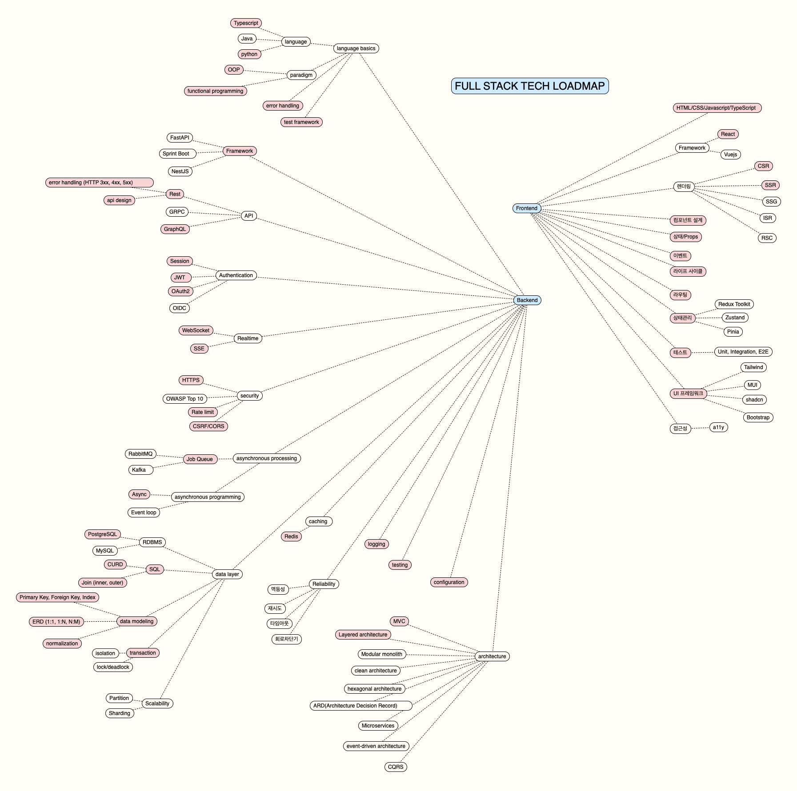

# Fullstack Engineering 학습 가이드

이 문서는 `full-stack-tech-loadmap.pdf`와 발표 메모를 바탕으로 정리한 풀스택 엔지니어링 학습 가이드입니다.

기준은 단순합니다.

- 아래 이미지에서 빨간색 배경으로 표시된 컴포넌트를 우선 학습한다.
- 흰색 컴포넌트 관련 내용은 기본적으로 문서에서 제외한다.
- 개인 과제는 게시판 프로젝트이지만, 어떤 게시판을 만들고 어떤 AI 기능을 붙일지는 개인 자유다. 모든 항목을 과제에 억지로 넣기보다 학습 우선으로 접근한다.
- 이번 과제에서는 빨간색 필수 항목을 중심으로 학습한다. 이번 개인 과제에서는 TypeScript 또는 Python 기반으로 풀스택 흐름을 끝까지 경험하는 것이 우선이다.

## 원본 로드맵 이미지

## 학습 방식

풀스택 학습은 AI와 함께 개발하면서 Top-down으로 진행한다.

Bottom-up으로 문법과 라이브러리부터 전부 외우려고 하면 범위가 너무 넓어진다. 먼저 만들고 싶은 게시판의 사용자 흐름을 정하고, 그 흐름을 구현하는 데 필요한 API, 데이터 모델, 인증, 프론트엔드, 보안, 테스트를 역으로 학습한다.

권장 흐름:

1. 만들 게시판의 목적과 사용자를 정한다.
2. 핵심 사용자 시나리오를 3-5개로 좁힌다.
3. 화면 흐름을 먼저 그린다.
4. 화면에서 필요한 API를 정의한다.
5. API에 필요한 데이터 모델과 ERD를 만든다.
6. 인증, 보안, 비동기 처리, 캐싱이 필요한 지점을 찾는다.
7. AI에게 설계 검토, API contract 리뷰, ERD 리뷰, 테스트 케이스 생성을 요청한다.
8. 구현 후 AI에게 코드 리뷰와 리팩토링 방향을 요청한다.

AI를 사용할 때 중요한 점:

- "코드 짜줘"보다 "이 기능의 요구사항, API, DB 모델, 실패 케이스를 먼저 설계해줘"라고 요청한다.
- 구현 전에는 설계를 검토하고, 구현 후에는 테스트와 엣지 케이스를 검토한다.
- AI가 만든 코드를 그대로 믿지 말고, 내가 설명할 수 있는 구조로 줄이고 고친다.
- 학습 목표는 빠른 완성이 아니라, 왜 이런 구조가 필요한지 설명할 수 있게 되는 것이다.

## 개인 과제 맥락: 게시판 프로젝트

개인 과제는 게시판 프로젝트다. 게시판의 주제와 AI 기능은 자유롭게 정해도 된다.

예시:

- 개발 회고 게시판
- 기술 질문 게시판
- 책/논문 리뷰 게시판
- 취업 준비 기록 게시판
- 프로젝트 아이디어 게시판
- 팀 회고와 피드백 게시판
- AI가 댓글을 요약해주는 게시판
- AI가 글의 태그를 추천해주는 게시판
- AI가 질문 글을 더 명확하게 다듬어주는 게시판
- AI가 유사 게시글을 찾아주는 게시판

게시판은 학습 항목을 연결하기 좋은 도메인이다.

- 글 목록, 상세, 작성, 수정, 삭제는 REST와 CRUD 학습에 적합하다.
- 회원가입과 로그인은 Session, JWT, OAuth2 학습에 적합하다.
- 댓글, 좋아요, 태그는 ERD와 Join 학습에 적합하다.
- 인기글, 최근 본 글, 검색 결과는 Redis 캐싱 학습에 적합하다.
- AI 요약, 태그 추천, 부적절한 표현 검사, 알림 발송은 Job Queue 학습에 적합하다.
- 댓글 알림이나 AI 처리 진행률은 WebSocket 또는 SSE 학습에 적합하다.

모든 항목을 게시판에 반드시 넣을 필요는 없다. 우선은 각 개념을 이해하고, 과제에는 자연스럽게 붙일 수 있는 기능만 선택한다.

## 스택 선택

백엔드는 `FastAPI`와 `NestJS` 중 하나를 선택한다.

| 선택지  | 추천 상황                                             | 학습 포인트                                                             |
| ------- | ----------------------------------------------------- | ----------------------------------------------------------------------- |
| FastAPI | Python 기반 AI 기능과 서버를 빠르게 연결하고 싶을 때  | Python, async API, Pydantic, dependency 구조                            |
| NestJS  | TypeScript 기반으로 백엔드 구조를 깊게 익히고 싶을 때 | controller, service, module, dependency injection, Spring과 유사한 구조 |

현실적인 추천:

- AI 기능 구현이 프로젝트의 중심이면 `FastAPI`.
- 백엔드 아키텍처와 TypeScript 서버 경험을 중시하면 `NestJS`.
- `NestJS`를 메인 서버로 쓰고 AI 기능만 `FastAPI`로 분리할 수도 있지만, 개인 과제에서는 복잡도가 올라간다.
- Java와 Spring Boot는 취업 관점에서는 중요하지만, 이번 과제에서는 우선순위를 낮추고 과제 이후 OOP와 함께 학습한다.

## 필수 학습 맵

| 영역              | 필수 항목                                                                                                                                          | 게시판 프로젝트에서 연결되는 부분                      |
| ----------------- | -------------------------------------------------------------------------------------------------------------------------------------------------- | ------------------------------------------------------ |
| 언어 기본기       | TypeScript, Python, OOP, functional programming, error handling, test framework                                                                    | 프론트엔드 타입, 백엔드 서비스 구조, 예외 처리, 테스트 |
| 백엔드 프레임워크 | FastAPI 또는 NestJS                                                                                                                                | 게시글/댓글/사용자 API 서버                            |
| API               | REST, API design, GraphQL, HTTP error handling                                                                                                     | 게시글 CRUD, 목록 조회, 실패 응답 설계                 |
| 인증              | Session, JWT, OAuth2                                                                                                                               | 로그인 유지, 토큰 인증, 소셜 로그인                    |
| 실시간            | WebSocket, SSE                                                                                                                                     | 댓글 알림, AI 처리 진행률, 실시간 업데이트             |
| 보안              | HTTPS, Rate limit, CSRF/CORS                                                                                                                       | 배포 보안, 로그인 요청 제한, 브라우저 보안 정책        |
| 비동기 처리       | Job Queue                                                                                                                                          | AI 요약, 태그 추천, 이메일/알림 발송                   |
| 비동기 프로그래밍 | Async                                                                                                                                              | API 서버의 비동기 I/O 처리                             |
| RDBMS             | PostgreSQL                                                                                                                                         | 사용자, 게시글, 댓글, 태그 저장                        |
| 데이터 계층       | SQL CRUD, Join, PK/FK/Index, ERD, normalization, transaction                                                                                       | 게시판 데이터 모델링과 안전한 데이터 변경              |
| 캐싱              | Redis                                                                                                                                              | 인기글, 조회수, 세션, rate limit 저장소                |
| 운영 기본기       | logging, testing, configuration                                                                                                                    | 요청 로그, 테스트, 환경변수 관리                       |
| 아키텍처          | MVC, Layered Architecture                                                                                                                          | controller/service/repository 책임 분리                |
| 프론트엔드        | HTML/CSS/JavaScript/TypeScript, React, CSR, SSR, component design, state/props, event, lifecycle, routing, state management, testing, UI framework | 게시판 화면, 인증 상태, API 연동, UI 구성              |

## 1. 언어 기본기

필수 항목:

- TypeScript
- Python
- OOP
- functional programming
- error handling
- test framework

학습 목표:

- TypeScript로 프론트엔드와 백엔드 타입을 안전하게 다룬다.
- Python을 쓰더라도 함수만 나열하지 않고 class, module, service 단위로 구조화한다.
- OOP를 통해 책임을 가진 객체와 계층을 설계한다.
- functional programming의 기본 패턴을 이용해 데이터 변환 로직을 명확하게 작성한다.
- 예외를 무시하지 않고 validation error, authentication error, domain error, server error를 구분한다.
- Jest, Vitest, pytest 중 하나로 테스트를 작성한다.

게시판에 적용하는 방법:

- 게시글 작성 요청 DTO 또는 schema를 타입으로 정의한다.
- 게시글 생성, 수정, 삭제 로직을 service 단위로 분리한다.
- 잘못된 요청, 권한 없는 수정, 존재하지 않는 게시글 조회를 각각 다른 오류로 처리한다.
- 핵심 service 로직에 테스트를 붙인다.

## 2. 백엔드 프레임워크

필수 선택:

- FastAPI
- NestJS

학습 목표:

- 요청이 router/controller에서 service로 이동하고, service가 repository 또는 data access 계층을 호출하는 구조를 만든다.
- request validation과 response schema를 정의한다.
- 인증 guard 또는 middleware를 적용한다.
- API 문서화 도구로 endpoint를 확인한다.

FastAPI를 선택했다면:

- `APIRouter`로 기능별 라우터를 나눈다.
- `Pydantic`으로 request/response schema를 정의한다.
- dependency 구조로 DB session, 인증 사용자, 설정 값을 주입한다.
- AI 기능과 서버 로직이 섞이지 않도록 service를 분리한다.

NestJS를 선택했다면:

- module, controller, provider 구조를 이해한다.
- DTO와 validation pipe를 사용한다.
- guard로 인증이 필요한 API를 보호한다.
- service에 도메인 로직을 두고 controller는 요청과 응답 처리에 집중한다.

## 3. API 설계

필수 항목:

- REST
- API design
- GraphQL
- HTTP error handling

학습 목표:

- 게시글, 댓글, 사용자 같은 리소스를 기준으로 REST API를 설계한다.
- URL, HTTP method, status code, response body 형식을 일관되게 만든다.
- 실패 응답을 클라이언트가 처리하기 쉬운 구조로 만든다.
- GraphQL은 REST와 비교할 수 있을 정도의 기본 개념만 익힌다.

게시판 API 예시:

- `GET /posts`: 게시글 목록 조회
- `POST /posts`: 게시글 작성
- `GET /posts/{postId}`: 게시글 상세 조회
- `PATCH /posts/{postId}`: 게시글 수정
- `DELETE /posts/{postId}`: 게시글 삭제
- `POST /posts/{postId}/comments`: 댓글 작성

오류 처리 예시:

- `400`: 요청 데이터가 잘못됨
- `401`: 로그인하지 않음
- `403`: 수정/삭제 권한이 없음
- `404`: 게시글 또는 댓글이 없음
- `429`: 요청이 너무 많음
- `500`: 서버 내부 오류

## 4. 인증

필수 항목:

- Session
- JWT
- OAuth2

학습 목표:

- Session 기반 인증과 JWT 기반 인증의 차이를 설명한다.
- access token과 refresh token의 역할을 이해한다.
- OAuth2 소셜 로그인 흐름을 이해한다.
- 인증과 인가를 분리해서 생각한다.

게시판에 적용하는 방법:

- 로그인한 사용자만 글을 작성할 수 있게 한다.
- 글 작성자만 수정과 삭제를 할 수 있게 한다.
- 소셜 로그인을 붙인다면 OAuth2 code flow를 이해하고 구현한다.
- cookie를 사용한다면 CSRF 방어까지 함께 고려한다.

## 5. 데이터베이스와 데이터 계층

필수 항목:

- PostgreSQL
- SQL CRUD
- Join
- Primary Key, Foreign Key, Index
- ERD
- normalization
- transaction

학습 목표:

- 사용자, 게시글, 댓글, 태그 같은 데이터를 ERD로 표현한다.
- 1:1, 1:N, N:M 관계를 이해한다.
- CRUD 쿼리와 Join 쿼리를 직접 작성할 수 있다.
- PK, FK, Index를 근거 있게 설계한다.
- 정규화를 통해 중복과 이상 현상을 줄인다.
- transaction이 필요한 유스케이스를 구분한다.

게시판에 적용하는 방법:

- `users`, `posts`, `comments`, `tags`, `post_tags` 테이블을 설계한다.
- 게시글 목록 조회에서 작성자 정보와 댓글 수를 함께 가져오는 Join을 작성한다.
- 게시글 작성과 첨부 데이터 생성이 함께 일어나야 한다면 transaction으로 묶는다.
- 자주 조회하는 컬럼에는 index를 고려한다.

## 6. 비동기 처리와 실시간 기능

필수 항목:

- Async
- Job Queue
- WebSocket
- SSE

학습 목표:

- 시간이 오래 걸리는 작업을 API 요청 흐름에서 분리한다.
- async API가 필요한 상황을 이해한다.
- WebSocket과 SSE의 사용 상황을 구분한다.
- AI 기능처럼 처리 시간이 긴 작업을 queue에 넣고 결과를 나중에 전달한다.

게시판에 적용하는 방법:

- AI 요약, 태그 추천, 부적절한 표현 검사 같은 작업을 Job Queue로 분리한다.
- AI 처리 진행률이나 완료 알림을 SSE로 전달한다.
- 댓글 알림이나 실시간 채팅형 댓글을 WebSocket으로 구현해볼 수 있다.

## 7. 보안

필수 항목:

- HTTPS
- Rate limit
- CSRF/CORS

학습 목표:

- HTTPS가 왜 필요한지, 배포 환경에서 어떻게 적용하는지 이해한다.
- 로그인, 회원가입, AI 요청처럼 비용이 큰 API에 rate limit을 적용한다.
- CORS가 서버 간 정책이 아니라 브라우저 보안 정책이라는 점을 이해한다.
- cookie 기반 인증을 사용할 때 CSRF 방어가 필요한 이유를 이해한다.

게시판에 적용하는 방법:

- 프론트엔드와 백엔드 origin이 다르면 CORS 설정을 명확히 한다.
- 로그인과 AI API에 rate limit을 둔다.
- 배포 시 HTTPS 환경에서만 인증 cookie가 동작하도록 설정한다.
- cookie session을 사용한다면 CSRF token을 고려한다.

## 8. 캐싱

필수 항목:

- Redis

학습 목표:

- cache hit, cache miss, TTL, invalidation을 이해한다.
- Redis를 캐시, session store, rate limit store 중 하나로 사용한다.
- 캐시가 정합성 문제를 만들 수 있다는 점을 이해한다.

게시판에 적용하는 방법:

- 인기 게시글 목록을 짧은 TTL로 캐싱한다.
- rate limit count를 Redis에 저장한다.
- session 기반 인증을 선택했다면 session store로 Redis를 사용할 수 있다.
- 게시글 수정이나 삭제 후 캐시 무효화를 처리한다.

## 9. 프론트엔드

필수 항목:

- HTML/CSS/JavaScript/TypeScript
- React
- CSR
- SSR
- component design
- state/props
- event
- lifecycle
- routing
- state management
- testing
- UI framework

학습 목표:

- React 컴포넌트를 역할별로 나눈다.
- props와 state의 책임을 구분한다.
- event handler와 side effect를 관리한다.
- 라우팅과 인증 상태를 처리한다.
- CSR과 SSR의 차이를 이해한다.
- UI framework를 사용해 일관된 화면을 만든다.

게시판에 적용하는 방법:

- 게시글 목록, 상세, 작성, 수정 화면을 만든다.
- 로그인 상태에 따라 글쓰기 버튼과 수정/삭제 버튼 노출을 제어한다.
- API 호출 상태를 loading, success, error로 나눈다.
- 전역 상태에는 인증 사용자, UI 상태, 서버 데이터 중 무엇을 둘지 구분한다.
- 게시글 form, comment list, pagination, modal, toast 같은 컴포넌트를 분리한다.

## 10. 로깅, 테스트, 설정

필수 항목:

- logging
- testing
- configuration

학습 목표:

- 로그를 단순 출력이 아니라 요청 추적과 오류 분석 수단으로 남긴다.
- 단위 테스트와 통합 테스트의 목적을 구분한다.
- 개발, 테스트, 운영 환경의 설정을 분리한다.

게시판에 적용하는 방법:

- 게시글 작성, 로그인 실패, AI 작업 실패에 로그를 남긴다.
- 게시글 생성, 권한 없는 수정, 잘못된 입력에 대한 테스트를 작성한다.
- DB URL, JWT secret, OAuth client secret, AI API key를 환경변수로 관리한다.

## 11. 아키텍처

필수 항목:

- MVC
- Layered Architecture

학습 목표:

- controller, service, repository의 책임을 구분한다.
- 도메인 로직을 controller에 직접 쓰지 않는다.
- DB 접근 로직을 service 안에 무질서하게 섞지 않는다.
- 프론트엔드에서도 page, component, API client, state 관리 책임을 나눈다.

게시판에 적용하는 방법:

- controller/router는 요청 검증과 응답 반환에 집중한다.
- service는 게시글 작성 권한, 수정 가능 여부, AI 작업 요청 같은 비즈니스 로직을 처리한다.
- repository 또는 data access 계층은 DB query를 담당한다.
- 프론트엔드는 page, component, hook, API client를 분리한다.

## 최종 학습 체크리스트

언어:

- [ ] TypeScript 타입 시스템을 활용해 런타임 오류를 줄일 수 있다.
- [ ] Python 코드를 OOP-like 구조로 작성할 수 있다.
- [ ] 예외 처리와 테스트를 기본 습관으로 사용한다.

백엔드:

- [ ] FastAPI 또는 NestJS 중 하나로 게시판 API 서버를 만들 수 있다.
- [ ] REST API를 설계할 수 있다.
- [ ] GraphQL의 기본 개념을 REST와 비교해서 설명할 수 있다.
- [ ] Session, JWT, OAuth2 흐름을 설명할 수 있다.
- [ ] WebSocket 또는 SSE의 사용 상황을 구분할 수 있다.
- [ ] Job Queue가 필요한 이유를 설명할 수 있다.

데이터:

- [ ] PostgreSQL ERD를 설계할 수 있다.
- [ ] CRUD, Join, transaction을 SQL로 작성할 수 있다.
- [ ] PK, FK, index를 근거 있게 설계할 수 있다.
- [ ] 정규화와 N:M 관계를 설명할 수 있다.

운영:

- [ ] HTTPS, CORS, CSRF, rate limit이 왜 필요한지 설명할 수 있다.
- [ ] Redis를 캐시, session store, rate limit store 중 하나로 사용할 수 있다.
- [ ] 로그, 테스트, 설정 관리를 운영 관점으로 구성할 수 있다.

프론트엔드:

- [ ] React 컴포넌트를 설계하고 state/props를 적절히 나눌 수 있다.
- [ ] CSR과 SSR의 차이를 설명할 수 있다.
- [ ] 라우팅, 인증 상태, 서버 데이터 로딩을 구현할 수 있다.
- [ ] UI framework를 활용해 일관된 게시판 화면을 만들 수 있다.

아키텍처:

- [ ] MVC와 Layered Architecture를 설명할 수 있다.
- [ ] controller, service, repository 책임을 분리할 수 있다.
- [ ] 기능 추가 시 어느 계층을 수정해야 하는지 판단할 수 있다.
